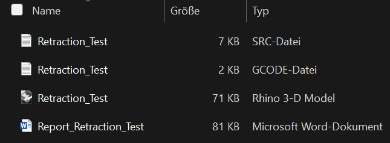
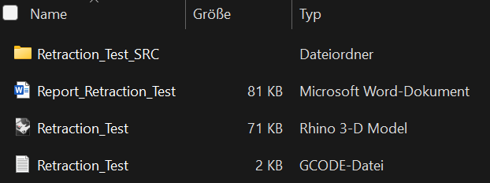

[comment]:<> (Header)
# Development of software solution for the use of slicers for polymer materials for additive manufacturing with concretes
**Institute:**  
[Chair of concrete structures](https://www.cee.ed.tum.de/mb/startseite/)  
TUM School of Engineering and Design  
Technical University Munich

**Author:** David Scheidt  
**Year:** 2025

[comment]:<> (Description)
# Description
This code is designed to connect Polymer Slicer such as [Ultimaker Cura](https://ultimaker.com/de/), [Orca Slicer](https://orca-slicer.com/) 
or [Simplify3D](https://www.simplify3d.com/) with state of the art 6 DOF [KUKA](https://www.kuka.com/de-de) robotics and visualisation 
using [Rhinoceros 3D](https://www.rhino3d.com/de/).
Therefor the Program automatically generates G-Code, evaluates the given code filtering for attributes (which get visualized in dedicated Rhino file), 
performes safety checks regarding Robot reachability and pump capability and finally outputs .src files, that can be interpreted by KUKA robots using KRL.  
In its current state it is limited to using [Cura](https://ultimaker.com/de/), but could be easily adapted for other Slicers as mentioned above.

[comment]:<> (Overview)
# Overview
This section gives an overview of the whole code structure. Each module houses a single or multiple functions, which are called via _c3dp_main.py_.

```text
main.py
│   # Entry point for the full code workflow.
│   # Executes slicing, kinematics, pump control, Rhino export, and report generation.
│
├── setup/                  # Centralized configuration handling
│   ├── load_settings.py       # Loads the JSON config file
│   ├── replace_strings.py     # Replaces placeholders in robot start/end code
│   ├── validate_value.py      # Validates config values based on expected types from slicer.cura.default
│   └── __init__.py
│
├── slicer/                    # Handles slicing logic (currently only using Cura); Can be extended for using other slicers
│   ├── __init__.py
│   └── cura/                  # CuraEngine-specific implementation
│       ├── slicing.py                          # Runs the actual slicing process (Command for Cura.exe)
│       ├── extract_settings.py                 # Validates and completes slicer arguments given in the specified .def file (using slicer.cura.default) 
│       ├── preset_arguments.py                 # Defines fixed slicing parameters 
│       ├── scaling_matrix.py                   # Computes scaling/rotation matrix for STL
│       ├── default/                            # Default Cura config files (checks of input type in .def are performed with these files)
│       │   ├── TUM_C3DP_fdmextruder.def.json
│       │   └── TUM_C3DP_fdmprinter.def.json
│       └── __init__.py
│
├── gcode/                 # G-code post-processing
│   ├── get_gcode.py          # Loads raw G-code lines from file
│   ├── simplify_gcode.py     # Reduces G-code to essential extrusion paths (Coordinates & Extrusion/Extrusion Mode)
│   ├── fits_printbed.py      # Checks whether the part fits the print bed
│   ├── min_max_values.py     # Extracts min/max coordinates of G-code
│   └── __init__.py
│
├── krl/                   # KUKA Robot Language (.src) file generation
│   ├── modify_to_krl.py      # Converts G-Code-like data into KRL syntax
│   ├── export_to_src.py      # Exports KRL to .src files (single or split)
│   ├── start_code_python.py  # Builds dynamic KRL header/footer (With input from python)
│   └── __init__.py
│
├── robot/                     # Robot kinematics and transformation logic
│   ├── kinematics.py             # OPW-based forward/inverse kinematics model
│   ├── mathematical_operators.py # Rotation and transformation matrix tools
│   └── __init__.py
│
├── pump/                   # Controls flow and extrusion speed
│   ├── calculate_flow.py      # Calculates volumetric flow [mm³/s]
│   ├── calculate_rpm.py       # Maps flow to RPM or voltage using pump curve (also limits Printspeed if necessary)
│   ├── calculate_linewidth.py # Calculates width of deposited lines 
│   └── __init__.py
│
├── rhino/                 # Rhino 3D model generation (.3dm)
│   ├── __init__.py
│   ├── pre_process/          # Prepares and manages Rhino file and layers
│   │   ├── create_rhino.py           # Initializes empty Rhino file
│   │   ├── evaluate_sublayers.py     # Organizes G-Code toolpath into layer hierarchy
│   │   ├── rhino_layermanager.py     # Manages layer structure (parent layers)
│   │   ├── rhino_linemanager.py      # Handles line styling and types (dashed, solid etc.)
│   │   └── __init__.py
│   └── process/              # Draws printbed, toolpath, and robot into Rhino
│       ├── draw_gcode.py             # Draws machine path and adds User strings to Rhino objects
│       ├── draw_printbed.py          # Draws 3D object of printbed into the file
│       ├── extend_gcode.py           # Adds additional metadata to points
│       ├── import_robot.py           # Imports robot geometry from .3dm file
│       └── __init__.py
│
├── report/                # Automated report generation (.docx)
│   ├── plot_gcode.py         # 3D visualization of sliced G-code
│   ├── plot_char_curve.py    # 2D Plot of pump characteristic curve
│   ├── write_report.py       # Inserts metadata into Word report template
│   ├── report_template.docx  # Report template with placeholders
│   └── __init__.py
│
├── tests/                         # Unit tests for robot and kinematic logic
│   ├── test_kinematics/
│   │   ├── kinematics_test_cases/    # Custom test cases generated using RoboDk for KUKA KR340 R3300 
│   │   │   └── __init__.py
│   │   ├── test_kinematics.py        # Tests forward/inverse kinematics
│   │   ├── setup_kinematics_test.py  # Loads test-specific config
│   │   └── __init__.py
│   ├── test_robot_math_operator.py   # Tests transformation logic from robot.mathmatical_operators
│   └── __init__.py
│
├──user_input/          # Folder with all necessary configuration files for use
│   ├── setup.json         # setup file to configure robot, pump, rhino and overwrite def.json input
│   ├── printer.def.json   # arguments regarding printer used in cura
│   ├── extruder.def.json  # arguments regarding extruder used in cura
│
├── requirements.txt         # Project dependencies
└── README.md                # Project description (this file)
```
## External Tools and Software Requirements

This project depends on the following third-party tools:

| Tool             | Purpose                                | Required Version / Notes          |
|------------------|----------------------------------------|-----------------------------------|
| **CuraEngine**   | Slicing STL files into G-Code          | Version 5.8                       |
| **Rhino 3D**     | Visualization and .3dm file generation | Version 8                         |
| **Microsoft Word** | For reading `.docx` reports            | Optional, for viewing of print report only |

> ⚠️ Make sure that you use explicitly Version 5.8 and CuraEngine.exe is properly installed and the paths is configured correctly in `setup.json`.
### CuraEngine.exe
To install the CuraEngine.exe download [Cura 5.8](https://github.com/Ultimaker/Cura/releases/) in Version 5.8 under **Assets**.
Within the installed folder you will find a `.exe` file named _CuraEngine.exe_  
Copy the link to this file (e.g.: _C:\Program Files\UltiMaker Cura 5.8.0\CuraEngine.exe_) into the `setup.json` 
file under Cura.cura_cmd_path as a value. 
You find the `setup.json` file under _\user_input\setup.json_ in my repository.
Your slicing engine is now set up for remote slicing.

### Rhinoceros 3D
To execute the code and visualize the sliced G-Code as well as the printbed and Robot [Rhinoceros 8](https://www.rhino3d.com/download/) is required.  
It might be possible to open the generated `.3dm` files with an older version, although this has not been tested.

### Microsoft Word
From the program a report in .docx format is written to the Output folder. To view this file I used [Microsoft Word](https://www.microsoft.com/de-de/microsoft-365/word).
It should be possible to access the `.docx` file using [Google Docs](https://workspace.google.com/intl/de/products/docs/) or [LibreOffice](https://de.libreoffice.org/). 
This was not tested so formatting issues might occur.


# Installation
To run this project locally, follow these steps:
1. Clone the repository
    ```bash
   git clone https://github.com/Dobby43/Master-Thesis
   cd repository
    ```
2. Create a virtual environment
    ```bash
    python -m venv .venv
    source .venv/bin/activate      # On Linux/macOS
    .venv\Scripts\activate         # On Windows
    ```
3. Install python dependencies
    ```bash
    pip install -r requirements.txt
    ```
> ⚠️ Make sure that Rhino 8 is installed to use the dependency _rhinoinside_

# Usage
The program is structured such, that the user input is only given and edited via `.json` files which all lie under \user_input. 
To fully customize the code to your needs three essential `.json` files need to be edited:

| filename            | Purpose                                                               | Notes                                                              |
|---------------------|-----------------------------------------------------------------------|--------------------------------------------------------------------|
| `setup.json`        | Custom input beyond Polymer slicer specific data                      | Input overwrites the input of the other two `.json` files          |
| `printer.def.json`  | Base Input data for Cura (considers only the deepest nested arguments) | <br/>To access parent arguments use Cura.cura_arguments in `setup.json` |
| `extruder.def.json` | Base Input data on extruder for Cura (considers only the deepest nested arguments)| To access parent arguments use Cura.cura_arguments in `setup.json` |

If every path is specified correctly in `setup.json` you can execute the main function.   
To execute the main function you can use the following CMD command in the folder that you saved the repository to:
```bash
.venv\Scripts\python.exe c3dp_main.py
```
After a successfully finished execution you will find a folder named with *{output_name}_hh_mm_ss* in the specified _output_directory_ from `setup.json`.  
This folder holds three files and an additional folder or four files depending on the user input.

1. Example output (`.src` file not split)  
     

2. Example output (`.src` file split)  
   

# Trouble shooting
In this section I will go through some of the most common mistakes regarding the use of this program.
In general three types of information output is given while running this code:

| output    | meaning                                                                                                     | comment                                                                                            |
|-----------|-------------------------------------------------------------------------------------------------------------|----------------------------------------------------------------------------------------------------|
| [INFO]    | Basic user information regarding progress or updates during the execution of the code                       | Gives an upfate on the current status of the program                                               |
| [WARNING] | Non crucial error messages; The program will finish as normal, although some restrictions have been applied | Can occur as well after crucial [ERROR] messages to inform about the source of [ERROR]             |
| [ERROR]   | Crucial Error suggesting wrong or invalid input                                                             | Can occure for example if start position of robot or any given point on printbed is not reachable  |

## Common errors

| problem                                                                                     | possible reason                                                                                                      | solution                                                                                                          |
|---------------------------------------------------------------------------------------------|----------------------------------------------------------------------------------------------------------------------|-------------------------------------------------------------------------------------------------------------------|
| [ERROR] No Object was found; Object must be bigger than minimal line-width and layer-height | Object in `.stl` file is to small to be printed                                                                      | rescale the object using Cura.cura_scaling in `setup.json`                                                        |
| [ERROR] Input Directory does not exist                                                      | typo in the input filepath for the directory of the `.stl` in `setup.json`                                           | Check given filepath under Directory.input_directory                                                              |
| [ERROR] Input .stl file inside input directory does not exist                               | `.stl` file does not exist under given name in `setup.json`                                                          | Check given filename under Directory.input_name                                                                   |
| [ERROR] CuraEngine-Path not found                                                           | Wrong filepath to CuraEngine.exe given                                                                               | Filepath should look similar to this: _C:\Program Files\UltiMaker Cura 5.8.1\CuraEngine.exe_                      |
| [ERROR] Configuration file for printer not found                                            | Missing .json ending for the printer.def.json file in `setup.settings.json` under Cura.cura_printer_config_file_path | Copy filename and directory and append `.json`                                                                    |
| [ERROR] Slicer not yet implemented"                                                         | Currently only Cura is available as an option to choose; Other slicer was specified in `setup.json`                  | Change Slicer.slicer_name to Cura                                                                                 |
| [ERROR] Object doesn't fit printbed in given orientation                                    | Object is to big for the specified build volume                                                                      | Scale or rotate object to fit inside boundaries                                                                   |
| [ERROR] Object not located fully on the printbed                                            | Object fits buildplate, but is not located properly                                                                  | Check Rhino output and move object using (e.g.: "mesh_position_x": "-200") in Cura.cura_arguments to shift object |
| [ERROR] Start / End position is not within Robot reach                                      | Specified start or end position violates given joint limitations                                                     | Change Start/End position to be within joint limits                                                               |
| [ERROR] Point (X ,Y, Z) on printbed is not reachable                                        | Object is partially or fully located outside the reach of the robot                                                  | Rearrange object on build-plate                                                                                   |
| [ERROR] .3dm file for Robot does not exist under given filepath or has the wrong format     | file for robot cell geometry has the wrong file format or is located in a different directory                        | Check if the given file exists and has the annotation `.3dm` inside `setup.json`                                  |
| [ERROR] Geometry type {type(geom)} not supported                                            | file for robot cell has entities, that cant be hadeled during import                                                 | Make sure, that the file only consists of Points, Curves, Lines, Brep, Mesh                                       |
| [ERROR] Pump capacity limited to l/min                                                      | Pump not capable of producing enougth flow, therfor printing velocity is reded to match maximum capacity of pump     | Reduce printing velocity or use higher flow pump                                                                  |
| [ERROR] Could not open the Rhino file                                                       | Rhino file was opend during the execution of the code                                                                | Rerun code and don't open Rhino file, while code is running                                                       |
| [ERROR] Self-collision: coordinates (X,Y,Z) are inside given base of robot                  | Object or Start/End position is inside given Robot base round joint axis A1                                          | Change Start/End position or location of print or printbed                                                        |
| [ERROR] Point (X,Y,Z) out of reachable domain of robot                                      | Object is not within reach of robot                                                                                  | Rearrange object on build-plate                                                                                   |
| [ERROR] All possible joint angles for point (X,Y,Z) exceed min/max joint angles             | Object is within reach, but all joint configurations violate joint limits                                            | Rearrange object on build-plate                                                                                   |
| [ERROR] Key inside robot start or end code not found                                        | The given key in start_code or end_code has no match inside `setup.Robot.json`                                       | Check if matching key exists                                                                                      |

